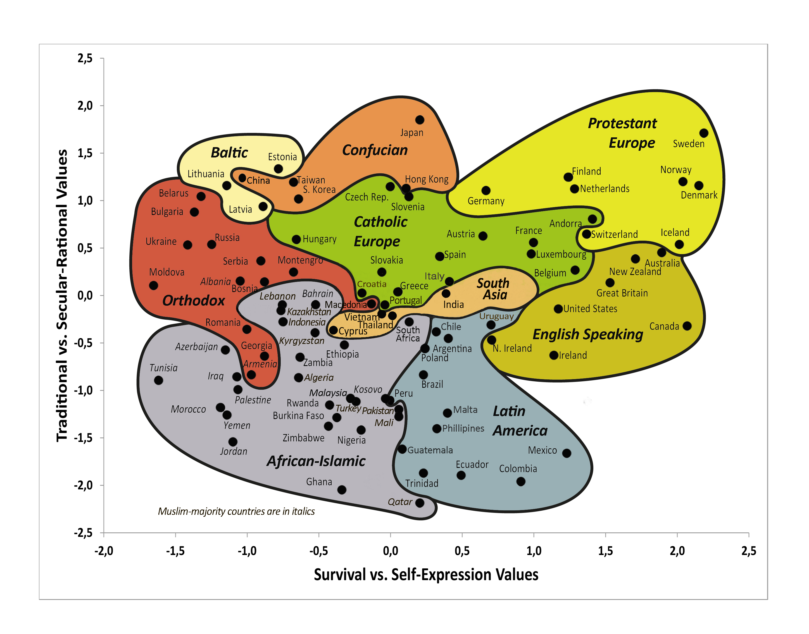

### The World Values Survey

The World Values Survey ([WVS](https://www.worldvaluessurvey.org/WVSContents.jsp)) is an international research program devoted to the scientific and academic study of social, political, economic, religious and cultural values of people in the world. The project’s goal is to assess which impact values stability or change over time has on the social, political and economic development of countries and societies.

### Data alalysis project

Based on data from the WVS official website survey, several topics were studied at both global and regional levels:

1. An analysis of tolerance levels and prevalent biases on a global scale, focusing on the correlation between tolerance and demographic characteristics;
2. A study of political and social markers using Kazakhstan as an example;
3. Creating a profile of the respondents who participated in the survey.

The visual representation of the study can be found [here](https://nickpvl.my.canva.site/wvs).
