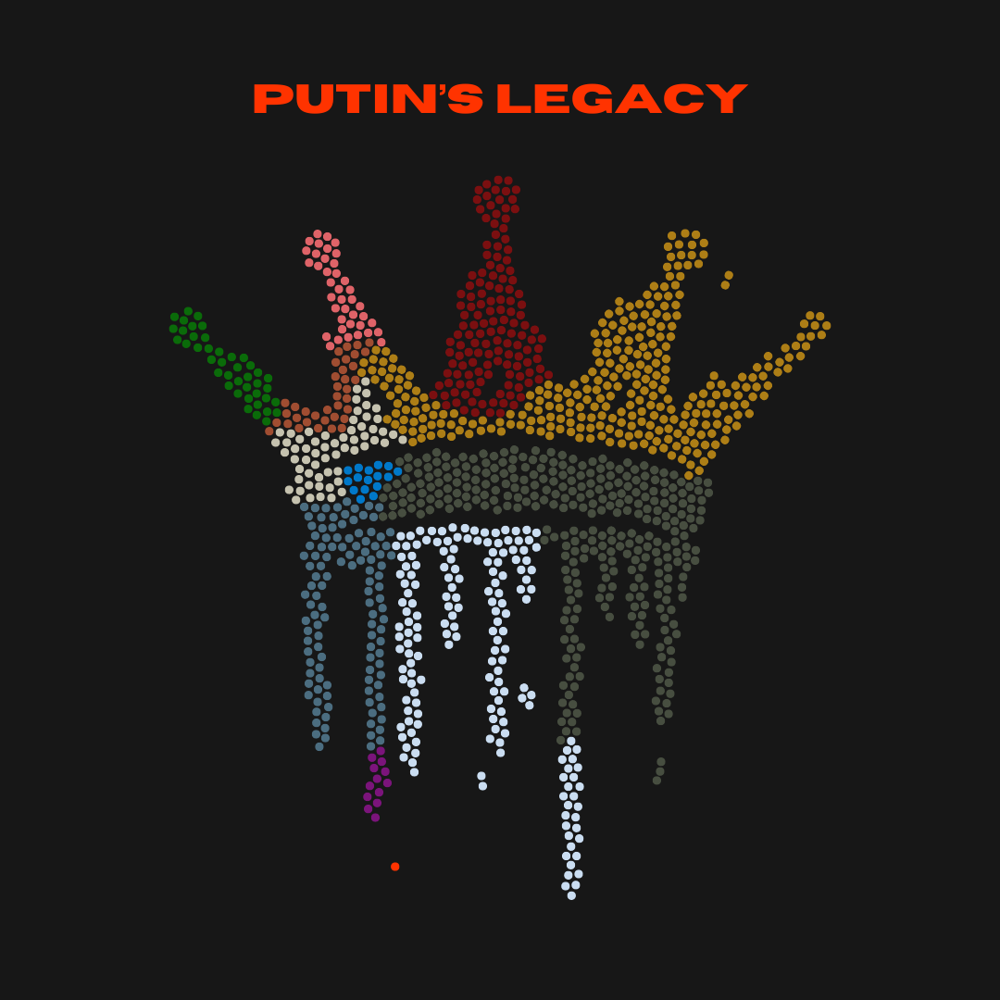
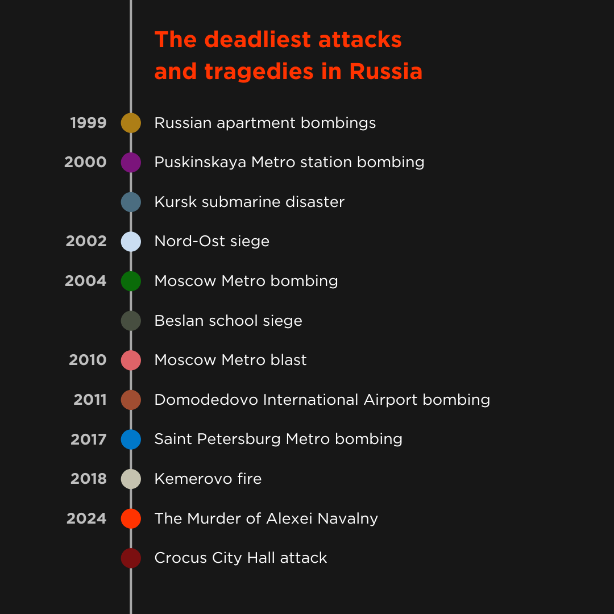
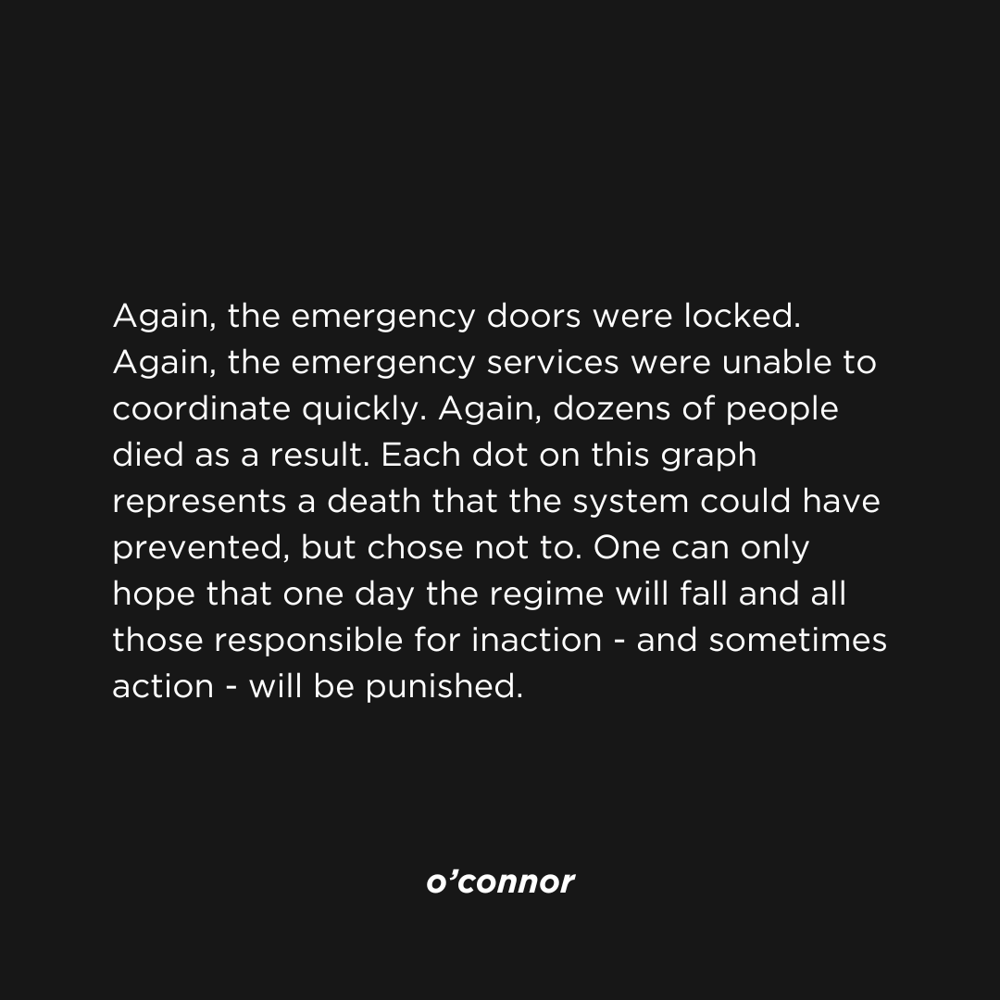

## Putin's legacy

A small visualization showing the victims of the largest terrors in Russia that occurred during Putin's presidency.

You can read more about mentioned attacks [here](https://www.dw.com/en/from-beslan-to-the-concert-hall-terror-attacks-in-russia/a-68652078), [here](https://www.atlanticcouncil.org/blogs/ukrainealert/putin-has-repeatedly-used-terror-attacks-to-tighten-his-grip-on-russia/#:~:text=The%20largest%20terrorist%20attack%20of,of%20more%20than%20300%20hostages.) and [there](https://www.theguardian.com/world/2024/feb/26/vladimir-putin-had-alexei-navalny-killed-to-thwart-prisoner-swap-allies-claim). 

  <ol class="carousel-indicators">
    <li data-target="#carouselExampleIndicators" data-slide-to="0" class="active"></li>
    <li data-target="#carouselExampleIndicators" data-slide-to="1"></li>
    <li data-target="#carouselExampleIndicators" data-slide-to="2"></li>
  </ol>
  

    

      
    

    

      
    

    

      
    

  

  <a class="carousel-control-prev" href="#carouselExampleIndicators" role="button" data-slide="prev">
    
    Previous
  </a>
  <a class="carousel-control-next" href="#carouselExampleIndicators" role="button" data-slide="next">
    
    Next
  </a>

